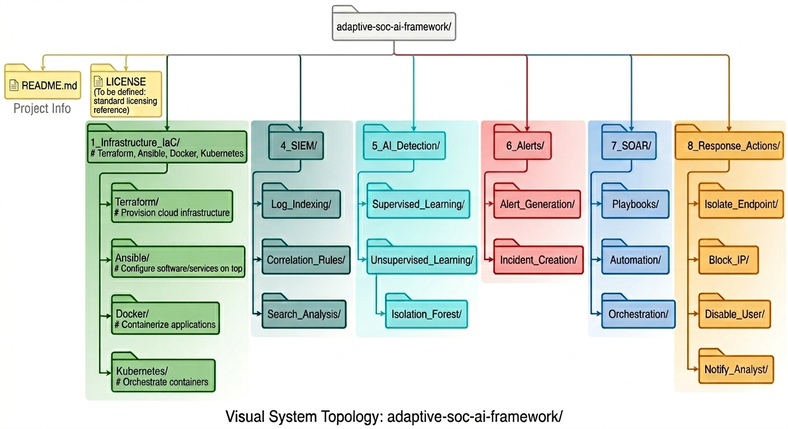

# Adaptive SOC AI Framework
**Version: 1.0**

A fully automated, Infrastructure-as-Code (IaC) driven Security Operations Center (SOC) framework with integrated SIEM, SOAR, and AI-driven anomaly detection.

This platform is designed to deliver adaptive threat detection and automated response using both supervised and unsupervised learning (**Isolation Forest**), built on a modular and scalable architecture.

---

## Live Demo

Explore the hosted dashboard demo here:

[Adaptive SOC AI Framework Demo](https://adaptive-soc-ai-framework-dtbnsixgfu2hxktqwww.jb.streamlit.app/)

The current dashboard is a demo-ready visual layer for the framework and will evolve from mock data to live API-backed telemetry as the platform matures.

---

## Project Architecture (Visual System Topology)



*The framework is organized into color-coordinated functional phases to ensure a systematic, scalable, and modular build-out.*

---

## AI Capabilities

* **Supervised Learning:** Detects known threats and categorized attack patterns.
* **Unsupervised Learning:** Isolation Forest for behavior-based anomaly detection.
* **Behavioral Analysis:** Identifies zero-day threats by monitoring system baselines.

---

## Security Stack

* **SOAR:** Tines
* **EDR/XDR:** LimaCharlie, Cybereason
* **NDR / AI Detection:** Darktrace
* **IDS/IPS:** Suricata
* **SIEM:** ELK Stack, Google Security Operations (formerly Chronicle)

---

## DevSecOps Integration

* **GitHub Actions:** Automated CI/CD pipelines.
* **Terraform:** Dynamic infrastructure validation.
* **Ansible:** Playbook testing and configuration management.
* **Docker:** Container security and validation.

---

## Core Principles

* **Adaptive:** Learns and evolves with threats.
* **Modular:** Easily customizable per client or environment.
* **Scalable:** Cloud-ready architecture utilizing European zones.
* **Automated:** End-to-end detection to response pipeline.
* **Git-First:** Everything is version-controlled and documented.

---

## Security Notes

The current Terraform foundation has passed `terraform fmt`, `terraform validate`, `terraform test`, `tflint`, and GitHub Actions CI. The remaining Snyk IaC findings are currently accepted as low-severity tradeoffs for this stage of the build:

* **Public subnet auto-assigned public IPs:** Intentional for the public subnet tier used by internet-facing resources and NAT placement.
* **S3 MFA delete not enabled:** Treated as a manual operational hardening step because MFA delete can complicate automated Terraform workflows.
* **Access-log bucket not self-logging:** Accepted to avoid recursive log-bucket chaining solely to satisfy scanner expectations.

These items should be revisited before production hardening is finalized.

---

## Demo Flow

The repository now supports a demo-ready validation path for both Terraform and the Terraform-to-Ansible handoff.

For a hosted visual walkthrough, open the live Streamlit demo:

[Adaptive SOC AI Framework Demo](https://adaptive-soc-ai-framework-dtbnsixgfu2hxktqwww.jb.streamlit.app/)

Run the local framework demo sequence from the repository root:

```bash
make demo
```

The full runbook is documented in [docs/demo-runbook.md](docs/demo-runbook.md).

---

## Author

**Nelson Ortiz**
GitHub: [iamnelsonnnn1-oss](https://github.com/iamnelsonnnn1-oss)
