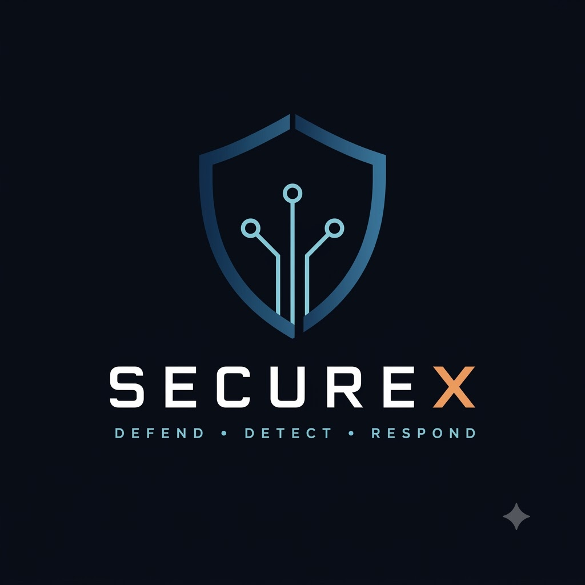

# Adaptive SOC AI Framework
**Version: 1.0**

<p align="center">
  
</p>

## The Mission
**Empowering the next generation of defenders.**
The Adaptive SOC AI Framework is a state-of-the-art, interactive **Cyber Range** and educational SIEM platform. Our mission is to provide students and security professionals with a high-stakes, "Live Fire" simulation environment. By blending automated Infrastructure-as-Code (IaC) with a real-time AI Mentor (**AI Charlie Analyst**), we transform complex threat telemetry into a specialized digital defense learning journey from Sentinel Initiate to Digital Sovereign.

This platform delivers adaptive threat detection and guided remediation using supervised learning, unsupervised behavioral analysis (**Isolation Forest**), and Large Language Model (LLM) integration.

## About

Adaptive SOC AI Framework is built for cybersecurity and DevSecOps professionals who want a practical, always-available environment to train incident response decisions before they are needed in production.

It combines:

* A live SOC simulation layer for triage, escalation, and reporting practice.
* IaC foundations (Terraform + Ansible) so infrastructure workflows stay realistic and reproducible.
* AI-guided coaching from Kai to help analysts connect actions to MITRE ATT&CK, NIST CSF, and operational outcomes.

This is designed to feel like the platform many defenders wish they always had: fast feedback, scenario repetition, and measurable readiness.

## How It Works

1. **Start the simulation:** Open the dashboard and inject or auto-ingest simulated attacks.
2. **Triage incoming alerts:** Use the Live Threat Feed, Geomap, and ATT&CK Matrix to identify what needs attention first.
3. **Open a case workflow:** Select a case, review recommended playbooks with confidence scores, then execute containment/remediation steps.
4. **Escalate and report:** Route cases to the right SOC tier, generate report output, and track response quality over time.
5. **Improve readiness continuously:** Use repeated scenarios and AI coaching to build speed, consistency, and decision quality.

### Value You Get

* Better SOC muscle memory under pressure.
* Clearer handoffs between detection, response, and DevSecOps operations.
* Repeatable analyst development with measurable operational readiness signals.
* A portfolio-grade demonstration of modern cyber range and security engineering capability.

---

## Live Demo

Explore the hosted dashboard demo here:

[Live SECUREX COMMAND Cyber Range](https://adaptive-soc-ai-framework-dtbnsixgfu2hxktqwvwjwb.streamlit.app/)

The current dashboard is a demo-ready visual layer for the framework and will evolve from mock data to live API-backed telemetry as the platform matures.

To show the new Next.js enterprise UI inside the existing Streamlit URL, set `NEXTJS_APP_URL` in Streamlit secrets to your deployed `web/` URL (for example, your Vercel production URL). When present, Streamlit switches to bridge mode and embeds that interface.

---

## Project Architecture (Visual System Topology)


*The framework is organized into color-coordinated functional phases to ensure a systematic, scalable, and modular build-out.*

---

## AI Capabilities

* **AI Charlie Analyst:** A real-time SLM (Small Language Model) co-pilot that mentors students through triage playbooks.
* **Generative Mentorship:** Dynamic explanations of "Why" specific remediation steps are chosen, mapped to NIST standards.
* **Supervised Learning:** Detects known threats and categorized attack patterns.
* **Unsupervised Learning:** Isolation Forest for behavior-based anomaly detection.
* **Behavioral Analysis:** Identifies zero-day threats by monitoring system baselines.

---

## Security Stack

* **SOAR:** Tines
* **EDR/XDR:** LimaCharlie, Cybereason
* **NDR / AI Detection:** Darktrace
* **IDS/IPS:** Suricata
* **SIEM:** ELK Stack, Google Security Operations (formerly Chronicle)

---

## DevSecOps Integration

* **GitHub Actions:** Automated CI/CD pipelines.
* **Terraform:** Dynamic infrastructure validation.
* **Ansible:** Playbook testing and configuration management.
* **Docker:** Container security and validation.

---

## Core Principles

* **Educational-First:** Bridging the gap between theory and field operations through gamified remediation.
* **Gamified Progression:** Earn XP and rank up from Sentinel Initiate to Digital Sovereign.
* **Adaptive:** Learns and evolves with threats.
* **Modular:** Easily customizable per client or environment.
* **Scalable:** Cloud-ready architecture utilizing European zones.
* **Automated:** End-to-end detection to response pipeline.
* **Git-First:** Everything is version-controlled and documented.

---

## Security Notes

The current Terraform foundation has passed `terraform fmt`, `terraform validate`, `terraform test`, `tflint`, and GitHub Actions CI. The remaining Snyk IaC findings are currently accepted as low-severity tradeoffs for this stage of the build:

* **Public subnet auto-assigned public IPs:** Intentional for the public subnet tier used by internet-facing resources and NAT placement.
* **S3 MFA delete not enabled:** Treated as a manual operational hardening step because MFA delete can complicate automated Terraform workflows.
* **Access-log bucket not self-logging:** Accepted to avoid recursive log-bucket chaining solely to satisfy scanner expectations.

These items should be revisited before production hardening is finalized.

---

## Demo Flow

The repository now supports a demo-ready validation path for both Terraform and the Terraform-to-Ansible handoff.

For a hosted visual walkthrough, open the live Streamlit demo:

[Adaptive SOC AI Framework Demo](https://adaptive-soc-ai-framework-dtbnsixgfu2hxktqwvwjwb.streamlit.app/)

Run the local framework demo sequence from the repository root:

```bash
make demo
```

The full runbook is documented in [docs/demo-runbook.md](docs/demo-runbook.md).

---

## Author

**Nelson Ortiz**
GitHub: [iamnelsonnnn1-oss](https://github.com/iamnelsonnnn1-oss)
